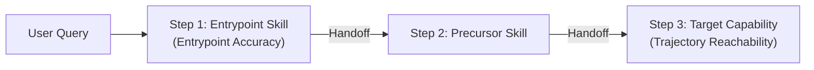

# skill-reach

[](https://github.com/google/skill-reach/actions/workflows/ci.yml)
[](https://google.github.io/skill-reach/)
[](https://pypi.org/project/skill-reach/)
[](https://www.python.org/)
[](LICENSE)

An evaluation suite for AI agent skill routing, collision detection, multi-step trajectory evaluation, and description optimization.

While standard evaluation suites measure skill execution after invocation, `skill-reach` measures the discovery and selection phase: determining whether incoming user queries route to the appropriate skill, execute required multi-step tool handoffs, and avoid redundant calls in the presence of competing descriptions.

## Contents

- [Installation](#installation)
- [Authentication](#authentication)
- [Quickstart](#quickstart)
- [Multi-Step Trajectory Evaluation](#multi-step-trajectory-evaluation)
- [Commands](#commands)
- [Supported Agents](#supported-agents)
- [Configuration](#configuration)
- [Reproducibility and Provenance](#reproducibility-and-provenance)
- [Development and Testing](#development-and-testing)
- [Repository Layout](#repository-layout)

## Installation

Requires Python 3.12+ and [uv](https://docs.astral.sh/uv/).

```sh
git clone https://github.com/google/skill-reach
cd skill-reach
uv sync
```

To enable dense semantic embeddings or the Google Antigravity SDK, install the optional extras:

```sh
# Install individual extras
uv sync --extra antigravity-sdk
uv sync --extra semantic

# Or sync with all extras
uv sync --all-extras
```

To install `reach` as an isolated standalone CLI tool from the local repository:

```sh
# Install base CLI tool
uv tool install .

# Or install with optional extras
uv tool install ".[semantic,antigravity-sdk]"
```

## Authentication

Configure credentials for your target model provider:

### Google Gemini API (AI Studio / Developer API)

When evaluating with Gemini models via API key authentication (`antigravity-sdk` or `antigravity-cli`):

```sh
export GEMINI_API_KEY="your-api-key"
# or
export GOOGLE_API_KEY="your-api-key"
```

> [!NOTE]
> `antigravity-cli` currently operates using Gemini Developer API keys (`GEMINI_API_KEY` or `GOOGLE_API_KEY`).

### Google Cloud Agent Platform

When using Agent Platform enterprise infrastructure, authenticate with Application Default Credentials (ADC) and configure your project:

```sh
# 1. Authenticate with Google Cloud
gcloud auth application-default login

# 2. Configure Agent Platform environment variables
export GOOGLE_CLOUD_PROJECT="your-project-id"
export GOOGLE_CLOUD_LOCATION="global"
export GOOGLE_GENAI_USE_ENTERPRISE=true
```

> [!NOTE]
> `GOOGLE_GENAI_USE_ENTERPRISE=true` directs the Google Gen AI SDK to use enterprise Agent Platform endpoints (`aiplatform.googleapis.com`) with Cloud IAM rather than the Gemini Developer API. Setting `GOOGLE_CLOUD_LOCATION="global"` targets the global endpoint with automatic capacity routing.

### Anthropic Claude Code

When evaluating with the Claude Code CLI runtime (`claude-code`), configure either Google Cloud Model Garden or direct Anthropic API credentials:

**Via Google Cloud Model Garden:**

```sh
# 1. Authenticate with Google Cloud
gcloud auth application-default login

# 2. Configure Claude Code for Google Cloud Model Garden
export CLAUDE_CODE_USE_VERTEX=1
export ANTHROPIC_VERTEX_PROJECT_ID="your-project-id"
export CLOUD_ML_REGION="us-east5"
```

**Via Anthropic API:**

```sh
export ANTHROPIC_API_KEY="your-anthropic-api-key"
```

## Quickstart

### 1. Lint skill manifests

Validate `SKILL.md` frontmatter, naming conventions, and schema constraints before running evaluations:

```sh
# Lint all skills in a directory or workspace
uv run reach lint path/to/skills

# Single-line format for editor linters or CI pipelines
uv run reach lint path/to/skills --format concise

# Explain a specific rule and its recommended remedy
uv run reach lint --explain reserved-name-collision
```

> [!TIP]
> `reach lint` runs offline without API calls. Integrate it into CI/CD pipelines to catch YAML defects, name collisions, and description length boundary errors before deploying skills or running benchmark sweeps.

### 2. Check vocabulary overlap

Analyze lexical competition across installed skills using BM25 token analysis without making model calls:

```sh
# Auto-discover skills from active runtime or specify directory
uv run reach overlap path/to/skills

# Inspect a specific skill and generate rewrite suggestions to avoid collisions
uv run reach overlap path/to/skills --skill my-skill --suggest
```

> [!TIP]
> `reach overlap` uses local lexical scoring without API calls. Run it before dispatching LLM evaluation probes to detect skill name collisions and overlapping vocabulary.

### 3. Run a quick evaluation

Evaluate a target skill against its top rivals in an isolated scratch workspace:

```sh
# Test immediately offline without API keys or token spend:
uv run reach eval my-skill --agent keyword

# Or probe live model runtimes:
uv run reach eval my-skill --agent claude-code

# Or probe a specific query directly against ground truth:
uv run reach eval --query "Deploy service to Cloud Run" --expected deploy-cloud-run
```

### 4. Inspect results in HTML

View evaluation results as an interactive, standalone HTML report:

```sh
uv run reach view .reach/eval.json --format html > report.html
```

## Multi-Step Trajectory Evaluation

In multi-turn agent execution, tasks frequently require invoking precursor skills (e.g. authentication or workspace preparation), performing intermediate handoffs, and reaching target capabilities. `skill-reach` captures ordered invocation sequences and evaluates multi-step trajectory metrics against disjunctive capability requirements:



| Metric                      |       Symbol        | Description                                                                                                                |
| :-------------------------- | :-----------------: | :------------------------------------------------------------------------------------------------------------------------- |
| **Entrypoint Accuracy**     | $A_{\text{entry}}$  | Proportion of queries where the initial skill invocation satisfies the primary requirement $\mathcal{R}_1$.                |
| **Trajectory Reachability** |  $R_{\text{traj}}$  | Proportion of queries where all required capabilities are reached across the trajectory.                                   |
| **Step Efficiency**         |    $\text{MRR}$     | Mean reciprocal rank ($\frac{1}{\text{step}}$) of step positions where required skills were invoked.                       |
| **Skill Selection F1**      |        $F_1$        | Harmonic mean of precision (relevant skills called / total called) and recall (requirements met / total).                  |
| **Skill Redundancy**        | $\text{Redundancy}$ | Excess skill invocations beyond the required target: $\max(0, \text{len}(\vec{s}) - 1)$. Zero indicates optimal execution. |

### Turn Budgeting & Early Exit

By default, `skill-reach` configures `max_turns = 3` and enables `early_exit = true`. During live probing:

- **Immediate Termination on Target**: When an agent invokes the expected target skill, execution terminates immediately, avoiding redundant post-target turns and saving API spend.
- **Precursor Continuity**: Non-target precursor skills do not abort execution early, allowing multi-step workflows to proceed naturally.
- **Turn Budget Enforcement**: If the target skill is not reached within `max_turns`, the probe halts cleanly.
- **Configurable**: Override defaults via CLI (`reach eval --max-turns 5 --no-early-exit`) or project configuration (`reach.toml`).

## Commands

`reach` provides primary evaluation, analysis, and optimization commands:

| Command    | Purpose                                                                                       | Network                         |
| :--------- | :-------------------------------------------------------------------------------------------- | :------------------------------ |
| `lint`     | Validates skill manifests for syntax, schema, length bounds, and name collisions              | Local (offline)                 |
| `check`    | Two-stage CI/CD regression gate: static pre-flight then empirical assertions                  | Local / Model API calls         |
| `overlap`  | Identifies lexical competition and suggests description rewrites                              | Local (offline)                 |
| `optimize` | Automated closed-loop description optimization using candidate synthesis and empirical probes | Model API calls                 |
| `eval`     | Probes catalogs to measure skill reachability and selection accuracy                          | Model API calls                 |
| `query`    | Synthesizes, converts, and inspects query evaluation sets                                     | Model API calls (drafting only) |
| `cluster`  | Partitions skill catalogs into cohesive subagent scopes to prevent routing decay              | Local (offline)                 |
| `sweep`    | Measures reachability decay and capacity knees across scaling catalog sizes                   | Model API calls                 |
| `diff`     | Performs A/B evaluation between two arms against a measured noise floor                       | Local (offline)                 |
| `view`     | Renders recorded artifacts as terminal scorecards or standalone HTML reports                  | Local (offline)                 |

Alongside setup, cleaning, and diagnostic utility commands:

| Command      | Purpose                                                                                | Network            |
| :----------- | :------------------------------------------------------------------------------------- | :----------------- |
| `doctor`     | Diagnoses environment prerequisites, runtime binaries, credentials, and catalog health | Local / API probes |
| `clean`      | Cleans cached Agent Registry payloads, ephemeral sandboxes, and run artifacts          | Local (offline)    |
| `init`       | Scaffolds configuration (`reach.toml`) and initializes skill workspaces                | Local (offline)    |
| `completion` | Generates shell tab-completion scripts (`bash`, `zsh`, `fish`)                         | Local (offline)    |

### Google Cloud Agent Registry Integration

Evaluate, audit, and benchmark skills hosted in the Google Cloud Agent Registry directly without manual downloads:

```sh
# Audit local workspace skills against Agent Registry to detect description drift
uv run reach check --project your-project-id --location global

# Evaluate reachability directly on remote registry skills
uv run reach eval --project your-project-id --auto

# Analyze lexical competition across remote registry skills
uv run reach overlap --project your-project-id

# Preview and safely clean cached registry skill bundles
uv run reach clean --dry-run
uv run reach clean
```

### `reach lint`

Validates skill directories and manifests against schema and agent runtime constraints:

- **Syntax & Schema**: Checks YAML frontmatter integrity, required keys (`name`, `description`), type validity, and trailing delimiter errors.
- **Length & Bounds**: Enforces name length (max 64 chars), description length (min 20, max 1024 chars by default), and lowercase kebab-case naming.
- **Name Mismatches**: Flags mismatches between skill frontmatter `name` and enclosing directory name.
- **Collisions & Duplicates**: Detects duplicate names across the corpus and collisions with built-in agent primitives or reserved CLI commands (e.g. `bash`, `edit`, `read`, `grep`).
- **Dependencies & Lockfiles**: Verifies declared skill dependencies (`allowed-tools` and `metadata.requires_skill`) exist in the resident catalog and detects local content drift against pinned `skills-lock.json` manifests.
- **Configurable Rules & Severities**: Overrides rule severities (`--error`, `--warn`, `--ignore`) or sets custom thresholds in `reach.toml`.
- **CI/CD Quality Gate**: Returns exit code `0` on clean runs, `1` on lint errors (or warnings with `--strict`), and `2` on CLI usage errors.

```sh
# Lint all skills in a directory (Rich table output)
uv run reach lint path/to/skills

# Single-line format for editor linters or CI log parsing
uv run reach lint path/to/skills --format concise

# Fail on warnings as well as errors in CI pipelines
uv run reach lint path/to/skills --strict

# Explain a specific rule and its recommended fix
uv run reach lint --explain reserved-name-collision

# Export structured report for pipeline automation
uv run reach lint path/to/skills --format json
```

### `reach check`

Executes an automated, two-stage regression quality gate for skill catalogs, tailored for local pre-push checks and CI/CD pipelines (GitHub Actions, Cloud Build, GitLab CI):

1. **Stage 1: Static Pre-flight**: Runs `reach lint --strict` in milliseconds with zero model calls. If any YAML error, naming collision, directory mismatch, unresolved dependency, or reserved tool violation is detected, it fails immediately with exit code `1`, aborting before any expensive API calls.
1. **Stage 2: Empirical Quality Gate**: If queries are supplied, probes candidate skills within a strict probe `--budget`, asserting statistical classification quality thresholds (`--min-recall`, `--min-accuracy`, `--max-misroute`) and multi-step trajectory thresholds (`--min-entrypoint`, `--min-reachability`, `--min-efficiency`, `--min-f1`, `--max-redundancy`).
1. **PR Change Scoping (`--changed`)**: Uses `git diff` to inspect only modified skills against base references (`--since origin/main`), saving probe budgets in large monorepos.
1. **GitHub Actions Integration**:
   - **Inline PR Review Annotations**: Automatically formats lint errors and regression violations as `::error file=...` annotations that appear directly on modified files in GitHub PR diffs.
   - **Job Step Summary (`$GITHUB_STEP_SUMMARY`)**: Automatically writes an interactive GFM Markdown dashboard scorecard to the Actions job overview.
   - **Auto-detection**: In GitHub Actions (`GITHUB_ACTIONS=true`), annotations and step summaries activate automatically without extra flags.

#### Exit Codes

- `0`: All checks passed (ready to merge).
- `1`: Stage 1 static pre-flight failure (syntax error, duplicate name, dependency error, or warning under `--strict`).
- `2`: Stage 2 empirical quality gate regression (recall, accuracy, misroute, or trajectory violation, or budget exceeded) or CLI usage error.

```sh
# Run full quality gate locally before opening a pull request
uv run reach check path/to/skills --queries queries/smoke.json

# Scope checks to only skills modified in this branch
uv run reach check path/to/skills --queries queries/smoke.json --changed --since origin/main

# Enforce classification and multi-step trajectory thresholds
uv run reach check path/to/skills \
                   --queries queries/smoke.json \
                   --min-recall 0.85 \
                   --min-accuracy 0.80 \
                   --max-misroute 0.05 \
                   --min-entrypoint 0.80 \
                   --min-reachability 0.90 \
                   --min-efficiency 0.80 \
                   --min-f1 0.85 \
                   --max-redundancy 0.25 \
                   --budget 50

# Output GitHub Actions workflow annotations for inline review comments
uv run reach check path/to/skills --format github
```

### `reach optimize`

Automates closed-loop skill description optimization. It consumes lexical competition findings (ceded terms and unclaimed distinctive body terms), synthesizes targeted candidate descriptions, runs sandboxed fast-path empirical probes against real-world agent runtimes, and ranks candidates by recall improvement ($\Delta \text{recall}$) and misroute reduction.

```sh
# Analyze and synthesize candidate descriptions for a skill
uv run reach optimize my-skill

# Evaluate candidates with fast-path probes against a query set
uv run reach optimize my-skill \
                      --queries queries/smoke.json \
                      --agent claude-code \
                      --budget 20

# View recommended changes as a unified diff
uv run reach optimize my-skill --format diff

# Automatically write the highest-ranking candidate description to SKILL.md
uv run reach optimize my-skill --auto-apply
```

### `reach eval`

Evaluates catalog reachability in two modes:

- **Quick evaluation**: Pass a skill name (`reach eval <skill>`) or ad-hoc query (`reach eval --query ... --expected ...`). Reach discovers skills from the runtime, drafts synthetic questions if needed, tests against top rivals, and prints a summary scorecard. Pass `--save <dir>` to keep artifacts.
- **Formal evaluation**: Provide `--config <file.toml>` or explicit flags (`--skills`, `--queries`, `--workdir`, `--out`). Reach mounts the full catalog or neighborhood, validates query sets, appends probe attempts to JSONL, and generates a schema-validated `.artifact.json`.

```sh
# Dry-run validation without sending model probes
uv run reach eval --config reach.toml --dry-run

# Run formal evaluation with JSON output
uv run reach eval --config reach.toml --format json
```

### `reach query`

Synthesizes benchmark query datasets directly from skill markdown bodies (masked to prevent circular leakage), and converts between JSON, JSONL, and CSV formats offline. Supports `--adversarial` to synthesize near-miss distractors from rival skills to measure false-positive trigger rates:

```sh
# Synthesize queries (defaults to saving in .reach/queries.json)
uv run reach query

# Synthesize directly to JSONL or CSV
uv run reach query -o queries.jsonl
uv run reach query -o queries.csv

# Synthesize queries including adversarial near-miss distractors
uv run reach query --adversarial --adversarial-count 2

# Convert datasets between JSON, JSONL, and CSV offline (0 LLM tokens)
uv run reach query .reach/queries.json -o queries.csv
uv run reach query queries.csv -o .reach/queries.json
```

### `reach cluster`

Partitions large skill catalogs into cohesive subagent scopes using modularity optimization on symmetric BM25 overlap scores:

```sh
# Partition skills into high-modularity clusters
uv run reach cluster path/to/skills

# Target subagent catalog size bounds
uv run reach cluster path/to/skills --target-size 10

# Export cluster partitions to JSON
uv run reach cluster path/to/skills --format json
```

### `reach sweep`

Runs multi-scale catalog scaling sweeps to detect capacity knees ($k^*$) and decompose performance decay into context dilution vs. distractor shadowing:

```sh
# Run whole-corpus scaling sweep across geometric scale steps
uv run reach sweep path/to/skills --agent antigravity-cli

# Run targeted scaling sweep on a single skill
uv run reach sweep path/to/skills --target my-skill --scales 5,10,20

# Export scaling study metrics to JSON
uv run reach sweep path/to/skills --format json
```

### `reach diff`

Compares a control run against a treatment run where exactly one experimental factor was varied (`description`, `rival`, or `scope`). It tests whether observed changes exceed the statistical noise floor using Wilson score intervals:

```sh
uv run reach diff control.jsonl treatment.jsonl --vary description
```

### `reach view`

Renders an evaluation artifact (`.json`) written by `reach eval`:

```sh
# Terminal scorecard with query breakdown
uv run reach view .reach/eval.json --show-queries

# Interactive standalone HTML report
uv run reach view .reach/eval.json --format html > report.html
```

## Supported Agents

Reach provides two levels of agent integration:

### 1. Live Empirical Evaluation (`reach eval`, `reach check`, `reach optimize`)

Live model probing and description optimization are currently supported for:

- **Google Antigravity** (`antigravity-cli`, default; `antigravity-sdk`): Drives the headless `agy` CLI with filesystem sandboxing, or the Python SDK with structured JSON schemas. Default model: `gemini-3.8-flash` (supports `gemini-3.8-flash`, `gemini-3.7-flash`, `gemini-3.6-flash`, `gemini-3.5-flash`, `gemini-3.5-flash-lite`, `gemini-3.1-pro`, `gemini-3.1-pro-preview`, `gemini-2.5-flash`, `gemini-2.5-pro`). Supports authentication via Gemini API keys or Google Cloud Agent Platform.
- **Anthropic Claude Code** (`claude-code`): Drives the `claude` CLI with multi-turn trajectory execution (`max_turns = 3`, `early_exit = true`), denied background tools, observed `Skill` tool calls, and prompt listing budget validation. Default model: `claude-sonnet-5` (supports `claude-sonnet-5`, `claude-opus-5`, `claude-haiku-4-5`). Supports authentication via Google Cloud Vertex AI Model Garden or direct Anthropic API.
- **Goose** (`goose`): Drives the headless `goose` CLI ([`aaif-goose/goose`](https://github.com/aaif-goose/goose)) with automated session management and execution observation. Default model: `gemini-3.6-flash` (supports `gemini-3.6-flash`, `gemini-3-flash-preview`, `gemini-3.1-flash-lite`, `gemini-3.1-pro-preview`). Authenticates via provider environment variables or standard Goose configuration profiles.
- **Pi Agent Harness** (`pi`): Drives the headless `pi` CLI ([`earendil-works/pi`](https://github.com/earendil-works/pi)) with progressive disclosure skill loading, tool isolation (`--tools read`), and native session JSONL transcript parsing. Default model: `gemini-3.8-flash` (supports any configured provider model). Authenticates via provider environment variables or `~/.pi/agent/settings.json`.
- **Lexical Baseline**:
  - `keyword`: High-speed lexical BM25 matching without model API calls or token costs.

Select an agent via CLI (`--agent <name>`) across `eval`, `check`, `optimize`, `overlap`, and `query`, or configure it in `reach.toml`:

```sh
uv run reach eval my-skill --agent antigravity-cli
```

### 2. Multi-Agent Discovery & Static Analysis (`reach lint`, `reach overlap`, `--global`)

For static linting, schema validation, collision detection, and user global discovery (`--global` / `-g`), Reach automatically resolves and inspects skill directories across the broader ecosystem:

- **Universal Agent Skills Standard**: `.agents/skills/` (project), `~/.agents/skills/` (global)
- **Anthropic Claude Code**: `.claude/skills/` (project), `~/.claude/skills/` (global)
- **Goose (AAIF)**: `.agents/skills/` (project), `~/.agents/skills/` (global)
- **Cursor**: `.cursor/skills/` (project), `~/.cursor/skills/` (global)
- **GitHub Copilot / VS Code**: `.github/skills/` (project), `~/.copilot/skills/` (global)
- **Pi Agent Harness** (`pi`): `.pi/skills/` (project), `~/.pi/agent/skills/` (global)
- **OpenAI Codex**: `.agents/skills/` (project), `~/.agents/skills/` (global)

## Configuration

Reach ships with bundled baseline defaults (`src/reach/reach.toml`) defining canonical model specifications, context windows, and agent configurations.

To customize settings for your project, copy the included template to `./reach.toml` in your repository root (or pass `--config <path>`):

```sh
cp reach.example.toml reach.toml
```

Project configurations overlay seamlessly on top of bundled defaults:

```toml
[general]
default_agent = "antigravity-cli"

[study]
skills = "path/to/skills"
queries = "queries/cloud.json"
workdir = "work"
out = "results/cloud.jsonl"

[lint]
max_description_length = 1024
max_name_length = 64
min_description_length = 20

[lint.rules]
missing-description = "error"
reserved-name-collision = "warn"
unresolved-placeholder = "warn"

[check]
min_recall = 0.80
min_accuracy = 0.80
max_misroute = 0.10
budget = 50
strict = true
since = "HEAD~1"

[runtime]
agent = "claude-code"
timeout_s = 200

[catalog]
mode = "neighborhood" # choices: neighborhood, all, singleton, sweep
size = 20
rivals = 10
seed = 42

[plan]
attempts = 5
retries = 2
backoff_s = 5.0
```

## Reproducibility and Provenance

To guarantee that evaluation comparisons are scientifically valid, every run generates three deterministic digests:

1. **Configuration Fingerprint**: 12-character SHA-256 digest of all parameters affecting runtime behavior (excludes local filesystem paths and tags).
1. **Corpus Digest**: Digest of skill names and descriptions in the target corpus.
1. **Ground-Truth Digest**: Digest of the query set and expected skill labels.

> [!IMPORTANT]
> Probes cannot be pooled or appended across mismatched arms unless explicitly overridden with `--append-across-arms`.

## Development and Testing

Run unit tests and linters locally:

```sh
# Run fast test suite
uv run pytest -q tests

# Run linter and formatting checks
uv run ruff check .
uv run ruff format --check .
uvx ty check
```

Mutation testing for statistical verification modules (`uncertainty.py`, `metrics.py`, `diff.py`):

```sh
uv run mutmut run
uv run mutmut results
```

## Repository Layout

```
src/reach/
├── cli/          # CLI command modules and entrypoints (check, eval, optimize, query, view)
├── runtime/      # Agent runtime adapters (Antigravity, Claude Code, Goose, Pi, Keyword)
└── views/        # Terminal scorecards, diff visualizers, and HTML reports
tests/
├── cli/          # CLI lifecycle, command flags, and workflow integration tests
└── runtime/      # Agent runtime contracts, subprocess drivers, and listing budgets
docs/             # MkDocs documentation, concept guides, and API reference
```

---

This is not an officially supported Google product. This project is not eligible for the [Google Open Source Software Vulnerability Rewards Program](https://bughunters.google.com/open-source-security).
