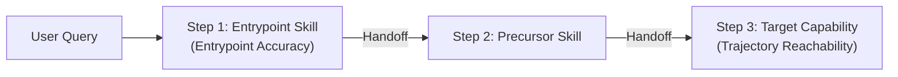

# `reach.metrics`

Compute standard evaluation, classification, routing, and multi-step trajectory metrics for skill selection probes.

---

## Multi-Step Trajectory Routing

Modern agent runtimes execute multi-turn conversational trajectories where a task may require entering via one skill, performing a precursor handoff, and terminating at the target capability:

---

## Trajectory Metrics

Reach evaluates multi-step trajectories against the ground-truth capability target $T$:

| Metric                      |       Symbol        | Definition & Meaning                                                                                                                             |
| :-------------------------- | :-----------------: | :----------------------------------------------------------------------------------------------------------------------------------------------- |
| **Entrypoint Accuracy**     | $A_{\text{entry}}$  | Fraction of queries where the **very first** skill invoked matches the target skill $T$ ($\vec{s}_1 = T$). Penalizes misrouted initial dispatch. |
| **Trajectory Reachability** |  $R_{\text{traj}}$  | Fraction of queries where the target skill $T$ is reached anywhere in the trajectory ($T \in \vec{s}$).                                          |
| **Step Efficiency (MRR)**   |    $\text{MRR}$     | Reciprocal rank $\frac{1}{\text{step}}$, measuring how directly and promptly the agent invoked the target skill.                                 |
| **Skill Selection F1**      |        $F_1$        | Harmonic mean of precision (target reached / total unique skills invoked) and recall (target reached).                                           |
| **Skill Redundancy**        | $\text{Redundancy}$ | Excess invocations beyond the target: $\max(0, \text{len}(\vec{s}) - 1)$. Zero indicates optimal, direct execution.                              |

---

## API Reference

<!-- prettier-ignore -->
::: reach.metrics
    options:
      show_root_heading: false
      members:
        - classification_report
        - ClassificationReport
        - classify_invocation_pattern
        - ClassMetrics
        - collisions
        - compute_f1
        - compute_precursor_graph
        - confusion
        - consistency
        - consistency_counts
        - decompose_pass_rate_drop
        - DecompositionResult
        - labeled_pairs
        - PrecursorEdge
        - score_trajectory
        - trajectory_scores
        - TrajectoryScore
