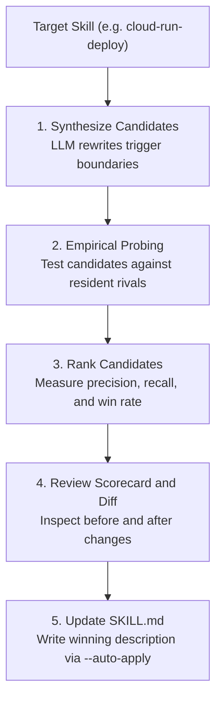

# `reach optimize`

Optimize a skill's description using automated candidate synthesis and empirical probes against resident rivals.

When two skills collide (for example, `gcp-cloud-run` and `docker-deploy`), adjusting the wording of their descriptions can eliminate misroutes without reducing legitimate activations.

---

## The Optimization Loop



---

## Synopsis

```bash
reach optimize [OPTIONS] SKILL
```

---

## Key Scenarios

/// tab | Optimize a single skill
Synthesize 3 candidates, test them with up to 30 probes, and print the ranking:

```bash
reach optimize cloud-run-deploy
```

///

/// tab | Auto-apply best candidate
Automatically overwrite the `description:` frontmatter in `SKILL.md` with candidate #1 if it improves reachability:

```bash
reach optimize cloud-run-deploy --auto-apply
```

///

/// tab | Review diff before applying
Output the suggested change as a unified diff:

```bash
reach optimize cloud-run-deploy --format diff
```

///

---

## Options

| Option             | Type    | Default           | Description                                                                                                                    |
| :----------------- | :------ | :---------------- | :----------------------------------------------------------------------------------------------------------------------------- |
| `SKILL`, `--skill` | String  | -                 | Skill name to optimize (required, positional or `--skill`).                                                                    |
| `--skills`         | Path    | Auto-discovered   | Path to skill directory or catalog tree.                                                                                       |
| `--queries`        | Path    | -                 | Labeled queries JSON file. If omitted, queries are automatically drafted.                                                      |
| `--candidates`     | Integer | `3`               | Number of candidate descriptions to synthesize.                                                                                |
| `--budget`         | Integer | `30`              | Maximum empirical probes to execute across candidate evaluations.                                                              |
| `--agent`          | Choice  | `from reach.toml` | Agent runtime for candidate empirical probing (`claude-code`, `antigravity-cli`, `antigravity-sdk`, `goose`, `keyword`, `pi`). |
| `--global`, `-g`   | Flag    | `false`           | Discover and inspect skills from user global configuration (`~/`).                                                             |
| `--auto-apply`     | Flag    | `false`           | Automatically write the highest-ranking candidate description to `SKILL.md`.                                                   |
| `--format`         | Choice  | `text`            | Output format: `text`, `json`, `diff`.                                                                                         |
| `--config`         | Path    | -                 | Path to `reach.toml` configuration file.                                                                                       |
