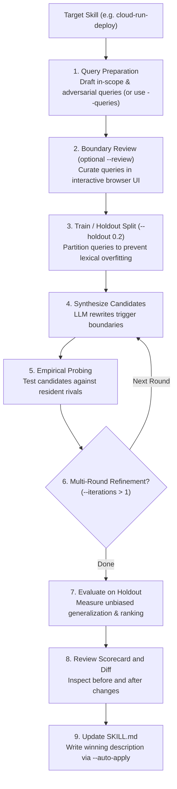

# `reach optimize`

Optimize a skill's description using automated candidate synthesis and empirical probes against resident rivals.

When two skills collide (for example, `gcp-cloud-run` and `docker-deploy`), adjusting the wording of their descriptions can eliminate misroutes without reducing legitimate activations.

> [!WARNING]
> **Closed-Loop Probe Safety**
> Description optimization runs fast-path empirical probes against candidate descriptions using real agent processes. Pass `--yes` / `-y` (or set `REACH_YES=1`) to bypass interactive confirmation prompts. When testing candidate descriptions against untrusted skills, execute Reach inside an isolated sandbox (e.g. Docker or [Google Cloud Run sandboxes](../guides/sandboxing.md)). Note that `--force` / `-f` remains exclusively dedicated to force-applying candidate descriptions when recall does not strictly increase.

---

## The Optimization Loop



---

## Synopsis

```bash
reach optimize [OPTIONS] SKILL
```

---

## Key Scenarios

/// tab | Optimize a single skill
Batteries-included optimization: automatically drafts queries, holds out 20% for generalization evaluation, tests 3 candidates against resident rivals, and prints the scorecard:

```bash
reach optimize cloud-run-deploy
```

///

/// tab | Multi-round hill climbing
Run iterative refinement rounds where the winning candidate of each round becomes the baseline for the next round:

```bash
reach optimize cloud-run-deploy --iterations 3
```

///

/// tab | Interactive boundary curation
Review and curate synthetic trigger and guardrail queries in a local browser interface before empirical probing begins:

```bash
reach optimize cloud-run-deploy --review
```

///

/// tab | Tune holdout validation split
Adjust the holdout ratio (default: `0.2` or 20%) to balance candidate training feedback against generalization test power:

```bash
reach optimize cloud-run-deploy --holdout 0.3
```

///

/// tab | Auto-apply best candidate
Automatically overwrite the `description:` frontmatter in `SKILL.md` with candidate #1 if it improves reachability:

```bash
reach optimize cloud-run-deploy --auto-apply
```

///

/// tab | Review diff before applying
Output the suggested change as a unified diff:

```bash
reach optimize cloud-run-deploy --format diff
```

///

---

## Options

| Option               | Type    | Default           | Description                                                                                                                    |
| :------------------- | :------ | :---------------- | :----------------------------------------------------------------------------------------------------------------------------- |
| `SKILL`, `--skill`   | String  | -                 | Skill name to optimize (required, positional or `--skill`).                                                                    |
| `--skills`           | Path    | Auto-discovered   | Path to skill directory or catalog tree.                                                                                       |
| `--queries`          | Path    | -                 | Labeled queries JSON file. If omitted, queries are automatically drafted.                                                      |
| `--candidates`       | Integer | `3`               | Number of candidate descriptions to synthesize per round.                                                                      |
| `--budget`           | Integer | `30`              | Maximum empirical probes to execute across candidate evaluations.                                                              |
| `--iterations`, `-i` | Integer | `1`               | Number of iterative hill-climbing refinement rounds.                                                                           |
| `--holdout`          | Rate    | `0.2`             | Fraction of queries held out for generalization validation (`0.0` - `0.9`).                                                    |
| `--review`           | Flag    | `false`           | Launch interactive browser review for generated queries before optimization begins.                                            |
| `--auto-queries`     | Flag    | `true`            | Automatically synthesize adversarial queries if none are provided (`--no-auto-queries` to disable).                            |
| `--agent`            | Choice  | `from reach.toml` | Agent runtime for candidate empirical probing (`claude-code`, `antigravity-cli`, `antigravity-sdk`, `goose`, `keyword`, `pi`). |
| `--global`, `-g`     | Flag    | `false`           | Discover and inspect skills from user global configuration (`~/`).                                                             |
| `--auto-apply`       | Flag    | `false`           | Automatically write the highest-ranking candidate description to `SKILL.md` if it improves reachability.                       |
| `--force`, `-f`      | Flag    | `false`           | Force apply candidate to `SKILL.md` even if no empirical improvement is detected.                                              |
| `--yes`, `-y`        | Flag    | `false`           | Bypass interactive safety confirmation prompts.                                                                                |
| `--candidate`, `-c`  | Integer | `1`               | 1-based candidate rank to inspect diff or apply.                                                                               |
| `--format`           | Choice  | `text`            | Output format: `text`, `json`, `diff`.                                                                                         |
| `--config`           | Path    | -                 | Path to `reach.toml` configuration file.                                                                                       |
