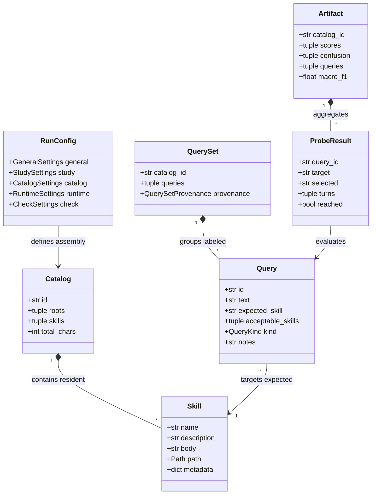

# How Reachability Works

This guide explains the mental model behind `skill-reach`: how skills compete, how reachability is measured, and why empirical probing differs from static text similarity.

---

## 1. Primary Abstractions

At the heart of `skill-reach` are the core domain abstractions that model skill discovery, study configuration, multi-turn execution, and empirical scoring:

- **[`Skill`](../api/models.md)**: A discrete capability defined by a `SKILL.md` file with YAML frontmatter (`name`, `description`) and markdown body instructions.
- **[`Catalog`](../api/models.md)**: The resident collection of skills available to an agent runtime during a session, either assembled as a full corpus, singleton, or competitive neighborhood.
- **[`Query`](../api/models.md)**: A realistic user prompt (`text`) with an assigned target ground truth (`expected_skill`), optional neutral helper/router skills (`acceptable_skills`), query kind (`kind`: `implicit`, `contextual`, `neighbor_negative`, or `out_of_scope`), author/difficulty `notes`, and unique identifier (`id`).
- **[`QuerySet`](../api/queries.md)**: An immutable collection of labeled queries with creation provenance, generator model metadata, and cryptographic digest verification.
- **[`RunConfig`](../api/config.md)**: The unified configuration hierarchy governing discovery precedence, catalog assembly strategy, runtime options, and CI quality gates.
- **[`ProbeResult`](../api/models.md)**: The telemetry record of a single query probe trial, tracking multi-turn tool calls, precursor handoffs, and final selection outcome.
- **[`Artifact`](../api/artifact.md)**: The persistent, verifiable evaluation run artifact containing confusion pairs, precision, recall, and Wilson score confidence intervals.

During runtime initialization, models do not see skill bodies; they operate under [Progressive Disclosure](progressive-disclosure.md), selecting capabilities solely via Level 1 frontmatter.

---

## 2. Why Overlap Is Not Collision

Many teams attempt to prevent skill confusion by computing cosine similarity between skill descriptions using embedding models or word counting.

In practice, **lexical similarity does not predict behavioral collision**:

- **False positives**: Two deployment skills that share boilerplate templates ("Deploy an application to...") may have 90% lexical overlap, but if one clearly specifies _Cloud Run_ and the other specifies _Kubernetes_, an LLM easily routes queries with 100% precision.
- **False negatives**: A skill with completely distinct vocabulary may have a subtle phrase ("Manage cloud resources") that pulls requests away from a specialized database skill.

`skill-reach` treats lexical overlap (calculated via asymmetric Lucene BM25) as a **targeting device** to identify competitive neighborhoods, and uses **empirical probes** to test what the model actually decides.

---

## 3. Metrics and Statistical Rigor

### Classification and Trajectory Metrics

When evaluating skill routing:

- **Top-1 Accuracy & Entrypoint Accuracy**: Fraction of scored probes where the first skill invocation matches `expected_skill` (or correctly abstains on `out_of_scope` queries).
- **Trajectory Reachability & Trajectory Recall**: Fraction of probes where `expected_skill` was reached at any turn within `max_turns` (`ClassMetrics.trajectory_recall` vs. Turn-1 `ClassMetrics.recall`).
- **Step Efficiency (MRR)**: Mean reciprocal rank ($\frac{1}{\text{rank}}$) of the first step where `expected_skill` was invoked.
- **Skill Redundancy**: Excess skill invocations beyond the target requirement: $\max(0, \text{len}(\vec{s}) - 1)$.

### Precision, Recall, and Turn-1 Conservation

For each skill in a resident catalog:

<!-- prettier-ignore-start -->
- **Recall (Turn-1 vs. Trajectory)**: `ClassMetrics.recall` measures Turn-1 entrypoint recall, while `ClassMetrics.trajectory_recall` credits multi-turn recovery when `expected_skill` is reached on a later turn:

    $$\text{Recall} = \frac{\text{True Positives}}{\text{True Positives} + \text{False Negatives}}$$

- **Precision & Turn-1 Conservation**: Out of all queries where the agent selected this skill on Turn 1, what fraction actually belonged to it?

    $$\text{Precision} = \frac{\text{True Positives}}{\text{True Positives} + \text{False Positives}}$$
<!-- prettier-ignore-end -->

Per-class `ClassMetrics` (`true_positives`, `false_positives`, `false_negatives`, `predicted`), `confusion()`, and `collisions()` strictly conserve Turn-1 predictions ($\sum \text{FN} = \sum \text{FP}$ and $\sum \text{predicted} = \text{scored}$). If a greedy distractor skill hijacks Turn 1 and the agent later recovers to `expected_skill` on Turn 2, the distractor still records a Turn-1 False Positive (`fp = 1`) so it surfaces in `report.top_attractors()`, while `trajectory_recall` and `trajectory_reachability` credit the Turn-2 recovery.

- **Macro Precision Over Active Classes**: `macro_precision` averages across active classes (`support > 0` or `predicted > 0`) while `macro_recall` and `macro_f1` average across classes with query support (`support > 0`). Unqueried, unpredicted catalog skills (`support = 0, predicted = 0`) never artificially deflate macro precision when evaluating against a full catalog label list, whereas zero-support distractors that receive false-positive predictions (`predicted > 0`) still penalize `macro_precision`.

### Neutral Helper & Router Skills (`acceptable_skills`)

Queries can declare optional `acceptable_skills` (for example, a catalog index or discovery router skill such as `finding-google-skills`). `skill-reach` treats `acceptable_skills` as **neutral exploratory steps** (analogous to `cd` or `list_dir`):

- **Runtime Turn Accounting**: Reading an `acceptable_skill` is a real LLM tool call and consumes 1 turn from `max_turns`, but it does **not** trigger `early_exit`—allowing the agent to proceed to the next turn to invoke `expected_skill`.
- **Scoring Neutrality**: `Query.scored_invocations` strips `acceptable_skills` before scoring:
  - **Assisted Hit (`("router-skill", "expected-skill")`)**: Scored as `("expected-skill",)` (`1 TP` for `expected-skill`, `0 FP` and `0` collisions for `router-skill`, `0` redundancy).
  - **Unfinished Exploration (`("router-skill",)` alone)**: Scored as `()` (`NO_SKILL`). `router-skill` is not blamed as a False Positive or collision (`0 FP`), while `expected-skill` records a False Negative (`1 FN` / `false_abstention`) because the target capability was never reached within `max_turns`.

### Abstention and Out-of-Scope Handling

- **Abstention Rate**: Fraction of all probes where the runtime invoked no skill.
- **False Abstention Rate**: Fraction of in-scope queries that failed to invoke any target or distractor skill.
- **Out-of-Scope Detection**: Recall on negative/out-of-scope probes where the runtime correctly refrained from selecting any skill.

### Multi-Attempt Consistency

When queries are probed across multiple attempts (replicates), **Consistency** measures the fraction of observed queries that made the exact same raw selection (`predicted_label`) on 100% of their attempts.

### Wilson Score Confidence Intervals

Small query sets are susceptible to random variation. `skill-reach` computes **Wilson score intervals** (default 95% confidence) for hit rates and recall. If a skill achieves 4/5 hits, the report displays the score as:

$$\text{0.800 [0.376, 0.964]}$$

This highlights where additional queries or probes are needed before drawing conclusions.

### Turn Budgeting & Early Exit

To balance multi-turn realism with evaluation speed and token cost, `skill-reach` enforces an execution turn budget with early abort capability via `TrajectoryTracker`:

- **Unified Cross-Agent Enforcement**: Every runtime (`antigravity-sdk`, `antigravity-cli`, `claude-code`, `goose`, `pi`, `fake`, `keyword`, and `retriever`) enforces turn budgets and early-exit invariants through `AgentRuntime.make_tracker` and `TrajectoryTracker.apply_to_outcome`.
- **Turn Budget (`max_turns = 3`)**: Limits conversation depth per probe. Every skill read (including neutral `acceptable_skills`) consumes 1 turn. If the agent fails to reach `expected_skill` within `max_turns`, the probe terminates.
- **Early Exit (`early_exit = true`)**: Live probes monitor agent tool calls. The moment `expected_skill` is invoked (or `max_turns` is reached), `skill-reach` halts execution and locks the trajectory tracker so no post-exit tool calls can append extra skills.
- **Precursor & Router Tolerance**: Intermediate precursor or neutral `acceptable_skills` do not trigger early exit; execution continues up to `max_turns` until `expected_skill` itself is reached.
