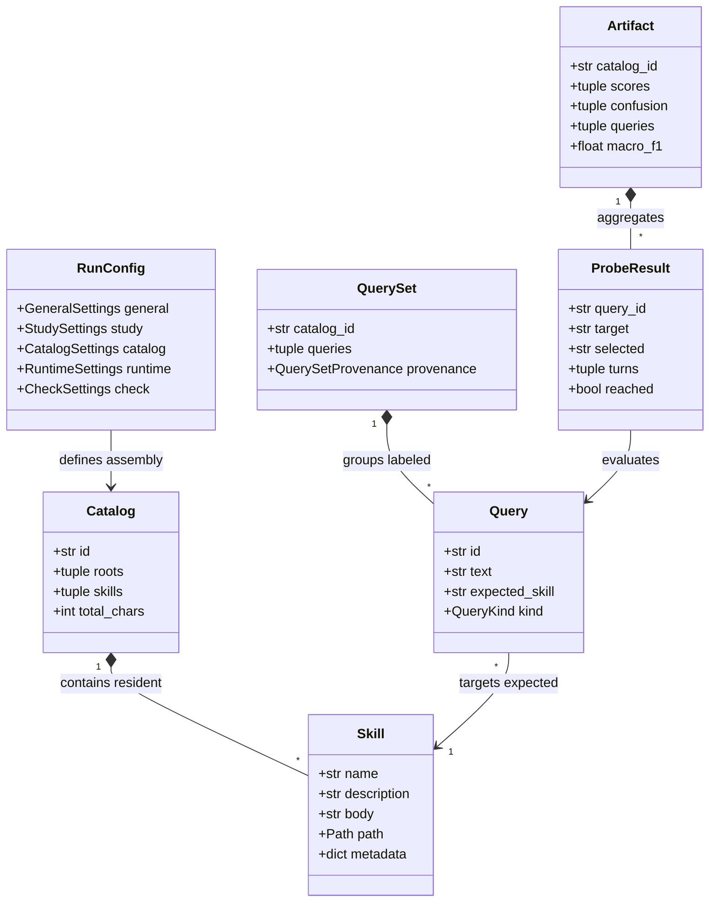

# How Reachability Works

This guide explains the mental model behind `skill-reach`: how skills compete, how reachability is measured, and why empirical probing differs from static text similarity.

---

## 1. Primary Abstractions

At the heart of `skill-reach` are the core domain abstractions that model skill discovery, study configuration, multi-turn execution, and empirical scoring:

- **[`Skill`](../api/models.md)**: A discrete capability defined by a `SKILL.md` file with YAML frontmatter (`name`, `description`) and markdown body instructions.
- **[`Catalog`](../api/models.md)**: The resident collection of skills available to an agent runtime during a session, either assembled as a full corpus, singleton, or competitive neighborhood.
- **[`Query`](../api/models.md)**: A realistic user prompt with an assigned target ground truth, query kind (`positive` or `negative`), and unique identifier.
- **[`QuerySet`](../api/queries.md)**: An immutable collection of labeled queries with creation provenance, generator model metadata, and cryptographic digest verification.
- **[`RunConfig`](../api/config.md)**: The unified configuration hierarchy governing discovery precedence, catalog assembly strategy, runtime options, and CI quality gates.
- **[`ProbeResult`](../api/models.md)**: The telemetry record of a single query probe trial, tracking multi-turn tool calls, precursor handoffs, and final selection outcome.
- **[`Artifact`](../api/artifact.md)**: The persistent, verifiable evaluation run artifact containing confusion pairs, precision, recall, and Wilson score confidence intervals.

During runtime initialization, models do not see skill bodies; they operate under [Progressive Disclosure](progressive-disclosure.md), selecting capabilities solely via Level 1 frontmatter.

---

## 2. Why Overlap Is Not Collision

Many teams attempt to prevent skill confusion by computing cosine similarity between skill descriptions using embedding models or word counting.

In practice, **lexical similarity does not predict behavioral collision**:

- **False positives**: Two deployment skills that share boilerplate templates ("Deploy an application to...") may have 90% lexical overlap, but if one clearly specifies _Cloud Run_ and the other specifies _Kubernetes_, an LLM easily routes queries with 100% precision.
- **False negatives**: A skill with completely distinct vocabulary may have a subtle phrase ("Manage cloud resources") that pulls requests away from a specialized database skill.

`skill-reach` treats lexical overlap (calculated via asymmetric Lucene BM25) as a **targeting device** to identify competitive neighborhoods, and uses **empirical probes** to test what the model actually decides.

---

## 3. Metrics and Statistical Rigor

### Classification and Trajectory Metrics

When evaluating skill routing:

- **Top-1 Accuracy**: Fraction of scored probes selecting the exact expected ground-truth skill on the first turn.
- **Entrypoint Accuracy**: Fraction of scored multi-turn probes where the initial invoked skill matches the primary target capability.
- **Trajectory Reachability**: Fraction of probes where the target skill was reached at any turn in the conversation trajectory.
- **Step Efficiency (MRR)**: Mean reciprocal rank measuring how promptly the target skill was reached without exploratory detours.

### Precision and Recall

For each skill in a resident catalog:

<!-- prettier-ignore-start -->
- **Recall**: Out of all queries where this skill was the expected target, what fraction did the agent route to this skill?

    $$\text{Recall} = \frac{\text{True Positives}}{\text{True Positives} + \text{False Negatives}}$$

- **Precision**: Out of all queries the agent routed to this skill, what fraction actually belonged to it?

    $$\text{Precision} = \frac{\text{True Positives}}{\text{True Positives} + \text{False Positives}}$$
<!-- prettier-ignore-end -->

### Abstention and Out-of-Scope Handling

- **Abstention Rate**: Fraction of all probes where the runtime invoked no skill.
- **False Abstention Rate**: Fraction of in-scope queries that failed to trigger any skill.
- **Out-of-Scope Detection**: Recall on negative/out-of-scope probes where the runtime correctly refrained from selecting any skill.

### Multi-Attempt Consistency

When queries are probed across multiple attempts (replicates), **Consistency** measures the fraction of observed queries that made the exact same selection on 100% of their attempts.

### Wilson Score Confidence Intervals

Small query sets are susceptible to random variation. `skill-reach` computes **Wilson score intervals** (default 95% confidence) for hit rates and recall. If a skill achieves 4/5 hits, the report displays the score as:

$$\text{0.800 [0.376, 0.964]}$$

This highlights where additional queries or probes are needed before drawing conclusions.

### Multi-Step Trajectory Scoring

In agent workflows involving multi-turn tool handoffs, `skill-reach` scores trajectories against the target skill:

- **Entrypoint Accuracy**: Whether the initial invoked skill matches the expected target.
- **Trajectory Reachability**: Whether the expected target skill is reached anywhere in the trajectory.
- **Precursor Analysis**: Maps observed transitions $(s_i \to s_j)$ with step latency and empirical handoff rates against declared skill dependencies.

### Turn Budgeting & Early Exit

To balance multi-turn realism with evaluation speed and token cost, `skill-reach` enforces an execution turn budget with early abort capability:

- **Consistent Cross-Agent Guarantees**: All supported agent drivers share identical turn-counting heuristics, stream monitoring, and process lifecycle management to ensure unbiased, apples-to-apples comparisons.
- **Turn Budget (`max_turns = 3`)**: Limits conversation depth per probe. If the agent fails to reach the target skill within the turn budget, the probe terminates without wasting further turns.
- **Early Exit (`early_exit = true`)**: Live probes monitor streaming agent actions. The moment the target skill is invoked, `skill-reach` immediately terminates the subprocess tree (via process groups on POSIX systems). This eliminates unnecessary follow-up turns, prevents runaway agent loops, and saves API tokens while recording reachability with complete accuracy.
- **Precursor Tolerance**: Intermediate precursor skills (e.g. workspace setup or authorization) do not trigger premature termination; execution proceeds up to `max_turns` unless the target skill itself is reached.
