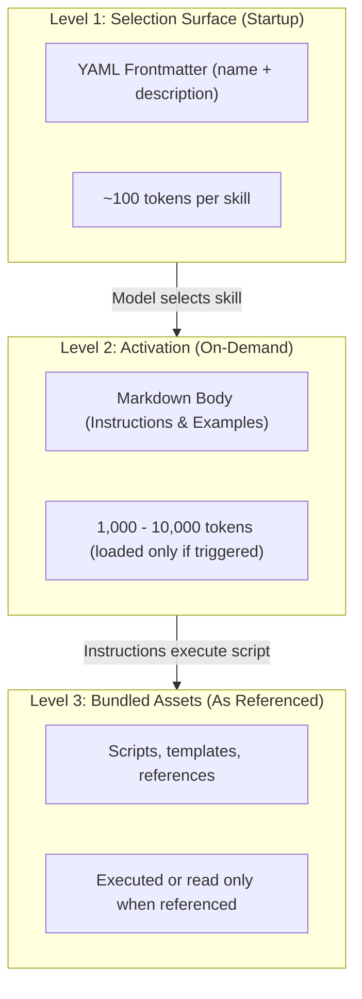

# Progressive Disclosure

Modern agent runtimes do not load all installed skills into model context at once. Doing so would consume hundreds of thousands of prompt tokens and degrade model instruction following.

Instead, platforms like **Claude Code**, **Google Antigravity**, and **OpenAI Codex** use a multi-tier pattern known as **progressive disclosure**.

---

## The Three-Stage Disclosure Ladder

1. **Level 1 (discovery and selection)**: At session start, only the YAML frontmatter `name` and `description` are placed in the agent's system prompt (~50-100 tokens per skill). The body remains on disk.
2. **Level 2 (activation)**: When the model decides to trigger a skill based on its description, the runtime reads the full `SKILL.md` body and injects it into the conversation context.
3. **Level 3 (execution)**: Any scripts, templates, or references bundled in the skill's directory are executed or read only as explicitly commanded by the activated skill body.

---

## Listing Budgets and Elision Behavior

Because the Level 1 selection surface lives inside the system prompt, agent runtimes bound the total context allocated to catalog listings.

| Runtime                                                       | Per-Description Guidance                 | Whole-Catalog Budget                             | Exceeded Budget Behavior                                                    |
| :------------------------------------------------------------ | :--------------------------------------- | :----------------------------------------------- | :-------------------------------------------------------------------------- |
| **Claude Code** (`claude-code`)                               | 1,024 characters (recommended ceiling)   | ~30,000 column listing budget (1% of 1M context) | Drops descriptions entirely, listing only bare skill names (`- <name>`)     |
| **Google Antigravity** (`antigravity-cli`, `antigravity-sdk`) | 1,024 characters                         | System prompt skill listing budget               | Truncates lower-ranked skills or rejects oversized system prompt extensions |
| **Goose** (`goose`)                                           | 1,024 characters                         | Extension declaration context window             | Truncates tool/extension listing surface                                    |
| **Pi** (`pi`)                                                 | 1,024 characters                         | Context window allocation                        | Omits descriptions of overflow skills                                       |
| **Offline Runtime** (`keyword`)                               | Configurable via `reach.toml` (`[lint]`) | Unconstrained catalog fit                        | Evaluates all resident skills without catalog elision                       |

### Why This Matters for Skill Developers

If a skill description exceeds 1,024 characters, [`reach lint`](../cli/lint.md) warns of `listing-overflow`. Even more critically, when an installed catalog exceeds the runtime prompt budget, Claude Code does not truncate descriptions in the middle; it **elides descriptions entirely** for lower-priority skills, listing only bare skill names (`- <name>`).

Without its description in the prompt, the model has no trigger boundaries or semantic criteria to select the skill, rendering it **unreachable regardless of user intent**.

[`reach lint`](../cli/lint.md) enforces these description boundaries before deployment (via [`reach.lint`](../api/lint.md)), and [`reach eval`](../cli/eval.md) lets you test whether competitive catalogs cause description elision under real runtime constraints. To learn more about how competitive catalogs are sampled and scored, see [How Reachability Works](how-it-works.md).
