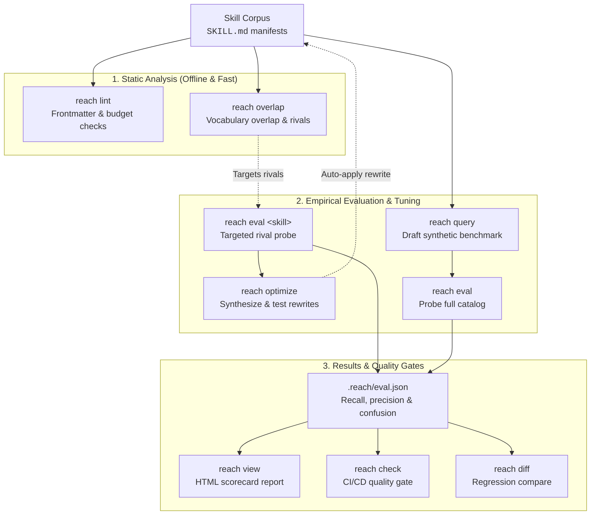

# Getting Started

This guide walks you through installing `skill-reach` and running your first reachability evaluation on a skill catalog.

---

## Installation

`skill-reach` requires **Python >= 3.12**.

### Using `uv` (Recommended)

Install `reach` as an isolated CLI tool with [`uv`](https://docs.astral.sh/uv/):

```bash
uv tool install skill-reach
```

Run directly without installation:

```bash
uvx skill-reach --help
```

### Using `pipx` or `pip`

```bash
pipx install skill-reach
```

Or in a virtual environment:

```bash
pip install skill-reach
```

Verify installation:

```bash
reach --version
```

---

## 60-Second Quickstart

### 1. Lint your skills

Validate your skill manifests (`SKILL.md`) to catch schema violations, missing descriptions, or descriptions that exceed agent prompt limits:

```bash
reach lint ./my-skills
```

Sample output:

```text
✓ Found 12 skills in ./my-skills
✓ Frontmatter valid: 12/12
⚠ Warning [listing-overflow]: 'deploy-docker' description length (1,120 chars) exceeds warning threshold (1024 chars)
```

### 2. Find rival skills with `reach overlap`

Identify which of your installed skills compete for the same user queries using Lucene BM25 scoring:

```bash
reach overlap ./my-skills
```

This outputs a competitive neighborhood ranking showing which skills share vocabulary and could poach user requests.

### 3. Run an evaluation with `reach eval`

Measure whether your skills are reachable when competing against their rivals. Reach prints an interactive terminal scorecard and automatically saves the evaluation results to `.reach/eval.json`:

```bash
reach eval ./my-skills/deploy-docker --agent keyword
```

/// tip
Use `--agent keyword` for instant, offline verification without consuming model tokens or requiring API keys: it is an in-memory lexical matching engine that matches query terms against skill names and descriptions using compiled word-boundary regular expressions and BM25 scoring, simulating agent routing decisions without subprocesses or network calls. For live model probing, select `--agent claude-code` or `--agent antigravity-cli`.
///

/// note | Evaluating a Single Skill vs. Full Catalog

- **Single skill quick eval** (`reach eval <skill>`): Auto-drafts test questions and evaluates one skill against rivals, saving results to `.reach/eval.json`.
- **Full catalog auto eval** (`reach eval --auto`): Auto-drafts questions for every skill in your catalog and probes them end-to-end in one step.
- **Full catalog benchmark** (`reach eval`): Automatically uses `.reach/queries.json` if present, or specify `--queries <path>`.
  ///

### 4. Inspect the interactive scorecard

Generate a self-contained HTML report from `.reach/eval.json` to visualize confusion pairs, precision, recall, and misrouted queries:

```bash
reach view --format html > report.html
open report.html
```

---

## Evaluation Workflows

Reach supports complementary workflows depending on whether you are doing fast, single-skill iteration or running an empirical benchmark suite across your whole catalog:



### Choosing Your Workflow

| Goal                                     | Path            | Command                         | Description                                                                                                                                                                                                                                                         |
| :--------------------------------------- | :-------------- | :------------------------------ | :------------------------------------------------------------------------------------------------------------------------------------------------------------------------------------------------------------------------------------------------------------------ |
| **Inspect a single skill**               | Quick Path      | `reach eval <skill>`            | Evaluates one skill against its nearest rivals. Auto-drafts queries, prints a scorecard, and saves to `.reach/eval.json`.                                                                                                                                           |
| **Evaluate whole catalog automatically** | Auto Mode       | `reach eval --auto`             | Synthesizes queries for all resident skills and immediately probes the catalog in one command. Use `--count` to set queries per skill.                                                                                                                              |
| **Benchmark against curated suite**      | Benchmark Path  | `reach query` <br> `reach eval` | Synthesize an authored benchmark (`.reach/queries.json` or `.jsonl`) for review, then probe your catalog to measure overall precision, recall, and confusion pairs.                                                                                                 |
| **Fix overlapping skills**               | Optimization    | `reach optimize <skill>`        | Synthesizes candidate descriptions and benchmarks them with fast probes, optionally auto-applying the winning rewrite to `SKILL.md`. Supports multi-round refinement (`--iterations`), holdout validation (`--holdout`), and interactive query review (`--review`). |
| **Automate in CI/CD**                    | CI Quality Gate | `reach check`                   | Two-stage quality gate combining static schema checks with empirical reachability thresholds for pre-merge validation.                                                                                                                                              |

---

## Next Steps

- Explore the complete [CLI Reference](cli/index.md) for all subcommands.
- Learn about [Progressive Disclosure](concepts/progressive-disclosure.md) and how LLM agents load skills into context.
- Set up an automated quality gate in your CI pipeline using [`reach check`](cli/check.md).
